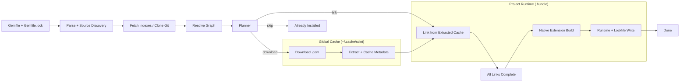
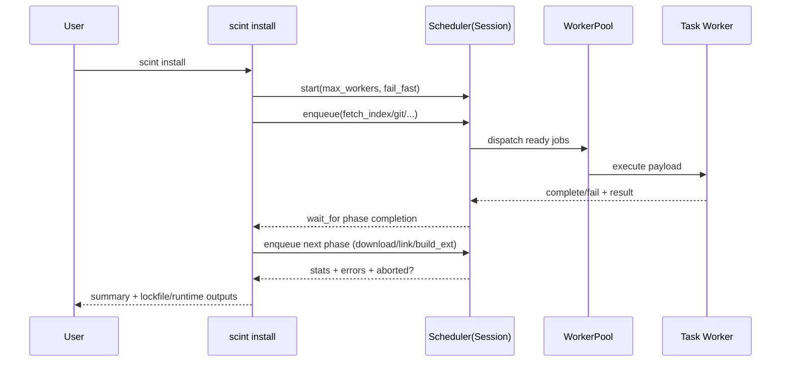
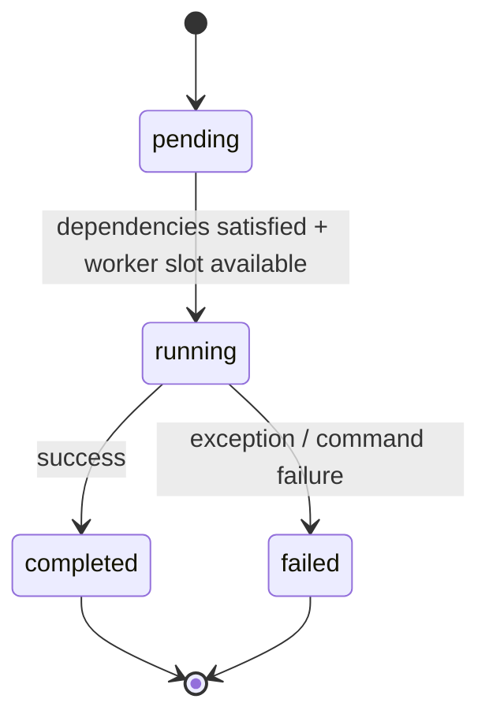

# Scint

Scint is an experimental Bundler/RubyGems replacement focused on high-throughput installs with a global cache and a fast local materialization step.

It is written in pure Ruby with no dependencies; Ruby is plenty fast for this job.

Scint is designed for full backwards compatibility with Bundler workflows:

1. It reads `Gemfile` and `Gemfile.lock`.
2. It writes standard `Gemfile.lock`.
3. It interoperates with Bundler runtime layout. For example, `BUNDLE_PATH=".bundle" bundle exec ...` is expected to work.
4. The intent is identical behavior with better install and execution throughput.

The core idea is:

1. Prepare artifacts once in a global cache (`~/.cache/scint`).
2. Materialize project-local runtime state into `.bundle/` as efficiently as possible (hardlinks where possible).
3. Execute work in explicit concurrent phases coordinated by a scheduler session.

## Why Scint

`scint` comes from *scintillation*: short, high-energy flashes rather than continuous glow.

That maps directly to the runtime model:

1. Event-driven scheduling.
2. Burst parallelism where safe.
3. Tight phase boundaries with clear handoffs.

## CLI

```bash
scint install
scint exec <command>
scint cache list
scint cache clear
scint cache dir
```

Performance and IO diagnostics:

```bash
# Ruby sampling profile (JSON)
SCINT_PROFILE=/tmp/scint-profile.json SCINT_PROFILE_HZ=400 scint install --force

# Ruby-level IO trace (JSONL)
SCINT_IO_TRACE=/tmp/scint-io.jsonl scint install --force

# Summarize high-volume IO operations for quick LLM review
scint-io-summary /tmp/scint-io.jsonl

# Syscall-level trace (Linux strace / macOS dtruss)
scint-syscall-trace /tmp/scint-sys.log -- scint install --force
```

Compatibility example:

```bash
BUNDLE_PATH=".bundle" bundle exec ruby -v
```

Defaults:

1. Local install/runtime directory: `.bundle/`
2. Global cache root: `~/.cache/scint` (or `XDG_CACHE_HOME`)

## Install Architecture

Scint install is phase-oriented. Each phase has explicit responsibilities and feeds the next phase.

1. Parse inputs (`Gemfile`, optional `Gemfile.lock`)
2. Fetch source metadata (indexes, git clones)
3. Resolve dependency graph
4. Plan actions (`skip`, `link`, `download`, `build_ext`)
5. Download/extract/cache artifacts
6. Link into local `.bundle` runtime
7. Build native extensions after link phase is ready
8. Write outputs (`Gemfile.lock`, runtime lock, warnings/summary)



## Scheduler as Session Object

The `Scheduler` is more than a queue: it is the install *session object*.
It owns global execution state and coordinates workers with phase-aware semantics.

The scheduler tracks:

1. Job graph and dependencies
2. Priority classes by job type
3. Worker pool scaling
4. Job state transitions (`pending`, `running`, `completed`, `failed`)
5. Follow-up chaining (for phase handoff)
6. Fail-fast abort state and error collection
7. Progress/stats snapshots used by reporting

Workers do not own global install strategy. They execute task payloads with context supplied by scheduler enqueuing and phase sequencing.



## Job Lifecycle



## Data Layout

Global cache (`~/.cache/scint`):

1. `inbound/` downloaded gem files
2. `extracted/` unpacked gem trees
3. `ext/` compiled extension cache keyed by ABI
4. `index/` source metadata/index cache
5. `git/` cached git repositories

Project-local runtime (`.bundle/`):

1. `ruby/<major.minor.0>/gems/` linked gem trees
2. `ruby/<major.minor.0>/specifications/` gemspecs
3. `ruby/<major.minor.0>/bin/` gem binstubs
4. `bin/` project-level wrappers
5. `scint.lock.marshal` runtime lock for `scint exec`

## Concurrency Model

Scint parallelizes all non-conflicting work aggressively:

1. Index fetch and git clone start early.
2. Downloads can chain follow-up link tasks.
3. Planner ordering prioritizes large downloads first to keep pipeline saturated.
4. Build-ext runs after link readiness to make dependencies visible.
5. Fail-fast mode aborts scheduling of new work after the first hard failure.

## Error Model

Scint is designed to be explicit on failure:

1. Install exits non-zero on failures.
2. Native build failures include full captured command output.
3. Final summary reports installed/failed/skipped counts.
4. `.gitignore` warning is emitted when `.bundle/` is not ignored.

## `scint exec` Runtime

`scint exec` sets runtime env and load paths from `scint.lock.marshal`, then `exec`s the target command.

Key behaviors:

1. Injects runtime load paths and bundler compatibility shim.
2. Sets `GEM_HOME`/`GEM_PATH` to the local `.bundle` runtime.
3. Prefers local `.bundle/bin` executables.
4. Rebuilds runtime lock from `Gemfile.lock` + installed gems when possible if missing.

## Aspirational Direction

The current architecture already separates phases and scheduling concerns. Planned direction is to make this even more explicit:

1. First-class session object API around scheduler state and phase transitions.
2. Isolated compile worker process with a simple line-protocol RPC (`CALL` / `RESULT`) for stronger fault isolation.
3. More deterministic bulk operations for extraction/linking.
4. Better per-phase telemetry for latency and saturation analysis.

## Status

Scint is experimental and optimized for architecture iteration speed. Behavior and internals may change quickly.
