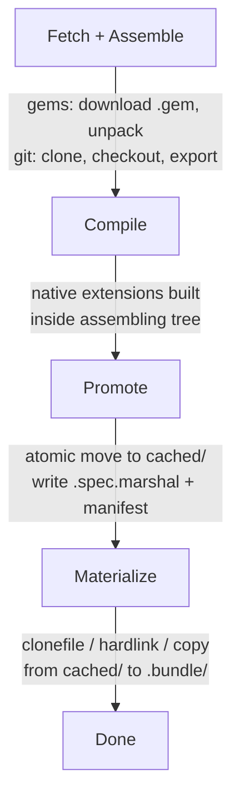
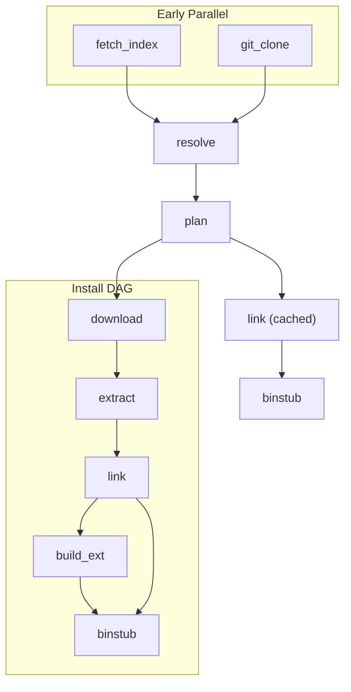

# Scint

```
tobi ~/t/fizzy ❯❯❯ scint install
💎 Scintellating Gemfile into ./.bundle (scint 0.7.1, ruby 4.0.1)

Fetching index https://rubygems.org

162 gems installed total (162 cached). (1.42s, 15 workers used)
```

Scint is an experimental Bundler replacement. Pure Ruby, no dependencies.

It reads your `Gemfile` and `Gemfile.lock`, writes standard `Gemfile.lock`, and materializes into `.bundle/` so `bundle exec` keeps working. Same behavior, much faster installs.

The core idea:

1. Prepare artifacts once in a global cache (`~/.cache/scint`).
2. Materialize into `.bundle/` via clonefile/hardlink/copy.
3. Warm installs are effectively instant because no fetch, extract, or compile happens when the cache is populated.

## Why "Scint"

From *scintillation*: short, high-energy flashes.

1. Event-driven scheduling.
2. Burst parallelism where safe.
3. Tight phase boundaries with clear handoffs.

## Install Pipeline

Every gem flows through a deterministic cache pipeline. Resolution decides *what* to install; the pipeline defines *how*.



### Phase details

1. **Fetch + Assemble** into `inbound/` and `assembling/`
   - Download gem payloads to `inbound/gems/`.
   - Clone/fetch git repos into `inbound/gits/<sha256-slug>/`.
   - Unpack `.gem` files into `assembling/<abi>/<full_name>/`.
   - For git sources: checkout, submodules, then export the tree into `assembling/<abi>/<full_name>/`.
2. **Compile** in `assembling/`
   - Native extension builds happen inside the assembling directory so outputs are part of the final tree.
3. **Promote** atomically to `cached/`
   - Move `assembling/<abi>/<full_name>/` to `cached/<abi>/<full_name>/`.
   - Write `cached/<abi>/<full_name>.spec.marshal` and `.manifest`.
   - Failed builds never reach `cached/`.
4. **Materialize** to `.bundle/`
   - Clonefile/reflink/hardlink/copy from `cached/<abi>/`.
   - No rebuild if the cached artifact is valid.

One truth source for warm installs: `cached/<abi>`.

## Scheduler

The `Scheduler` is the install session object. It owns the job graph, worker pool, and phase coordination.



Job priorities (lower = dispatched first):

| Priority | Job Type | Concurrency |
|----------|----------|-------------|
| 0 | `fetch_index` | all workers |
| 1 | `git_clone` | all workers |
| 2 | `resolve` | 1 |
| 3 | `download` | bounded (default 8) |
| 4 | `extract` | IO-limited |
| 5 | `link` | IO-limited |
| 6 | `build_ext` | CPU-limited (slots x make -j) |
| 7 | `binstub` | 1 |

Workers start at 1, scale dynamically up to `cpu_count * 2` (max 50). Compile concurrency is tuned separately: a small number of slots each running `make -jN` to keep CPU saturated without thrashing.

Fail-fast mode aborts scheduling after the first hard failure.

## Data Layout

Global cache (`~/.cache/scint`):

```
~/.cache/scint/
  inbound/
    gems/<full_name>.gem
    gits/<sha256-slug>/
  assembling/
    <ruby-abi>/<full_name>/
  cached/
    <ruby-abi>/
      <full_name>/
      <full_name>.spec.marshal
      <full_name>.manifest
  index/
    <source-slug>/
```

ABI key example: `ruby-4.0.1-arm64-darwin25`

Project-local runtime (`.bundle/`):

```
.bundle/
  ruby/<major.minor.0>/
    gems/           # materialized gem trees
    specifications/ # gemspecs
    bin/            # gem binstubs
  bin/              # project-level wrappers
  scint.lock.marshal
```

Cache root precedence: `SCINT_CACHE` > `XDG_CACHE_HOME/scint` > `~/.cache/scint`.

## Cache Validity

A cached artifact is valid when:

1. `cached/<abi>/<full_name>/` exists.
2. `.spec.marshal` exists and loads.
3. `.manifest` exists, parses, schema version is supported, and fields match.
4. If the gem has native extensions, the build-complete marker exists.

Invalid entries are rebuilt through the full pipeline. Legacy entries without manifests are read-compatible but emit telemetry for deprecation tracking.

## Warm Path Guarantees

1. If `cached/<abi>/<full_name>/` is valid, no fetch/extract/compile occurs.
2. Deleting `.bundle/` triggers only materialization.
3. Materialization is IO-bound and close to instantaneous on warm cache.
4. Incomplete assemblies are never promoted.

## CLI

```bash
scint install           # install from Gemfile.lock
scint add <gem>         # add to Gemfile and install
scint remove <gem>      # remove from Gemfile and install
scint exec <cmd>        # run command in bundle context
scint cache list        # list cached gems
scint cache clear       # clear global cache
scint cache dir         # print cache root
```

Options: `--jobs N`, `--path P`, `--verbose`, `--force`.

`scint exec` sets `GEM_HOME`/`GEM_PATH`, injects load paths from `scint.lock.marshal`, and execs the command. Bundler compatibility: `BUNDLE_PATH=".bundle" bundle exec` works against the same layout.

## Diagnostics

```bash
# Ruby sampling profile
SCINT_PROFILE=/tmp/profile.json scint install --force

# Ruby IO trace
SCINT_IO_TRACE=/tmp/io.jsonl scint install --force

# Summarize IO trace
scint-io-summary /tmp/io.jsonl

# Syscall trace (strace/dtruss)
scint-syscall-trace /tmp/sys.log -- scint install --force
```

## Benchmarking

```bash
bin/scint-vs-bundler [--force] /path/to/project
bin/scint-bench-matrix [--force] --root /path/to/projects
```

`scint-bench-matrix` runs cold/warm benchmarks for every project subdirectory and writes `logs/bench-<timestamp>/summary.tsv` and `table.md`. If `<root>/<project>-test.sh` exists, it runs as a smoke test after the benchmark.

## Status

Experimental. Optimized for architecture iteration speed.
